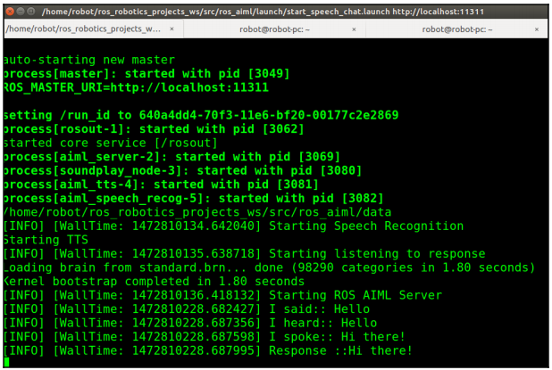

# 3.13. Работа с AIML в ROS

#### Создание пакета ros\_aiml

Выполните:

```text
$ catkin_create_pkg ros_aiml rospy std_msgs sound_play
```

Внутри пакета `ros_aiml` создайте папки с именами `data`, `scripts` и `launch` для хранения данных, файлов AIML, скриптов Python и файлы запуска ROS. Структура `ros_aiml`:


Вы можете хранить файлы AIML в папке `data`, и все файлы запуска могут быть сохранены внутри папки `launch`. Скрипты сохраняются в папке `scripts`. Давайте посмотрим на каждый скрипт.

#### Узел aiml\_server

Как мы уже обсуждали, `aiml_server` отвечает за загрузку и сохранение AIML и AIM файлы мозга. Он подписан на `/chatter`, которая является входным сигналом для AIML интерпретатора и публикует тему `/response`, которая является ответом от него. Это основной фрагмент кода `aiml_server.py`:

```text
def load_aiml(xml_file):
    data_path = rospy.get_param("aiml_path")
    print data_path
    os.chdir(data_path)
    
    if os.path.isfile("standard.brn"):
        mybot.bootstrap(brainFile = "standard.brn")
    else:
        mybot.bootstrap(learnFiles = xml_file, commands = "load aimlb")
        mybot.saveBrain("standard.brn")

def callback(data):
    input = data.data
    response = mybot.respond(input)
    rospy.loginfo("I heard:: %s",data.data)
    rospy.loginfo("I spoke:: %s",response)
    response_publisher.publish(response)

def listener():
    rospy.loginfo("Starting ROS AIML Server")
    rospy.Subscriber("chatter", String, callback)
    # spin() simply keeps python from exiting until this node is stopped
    rospy.spin()
    
if __name__ == '__main__':
    load_aiml('startup.xml')
    listener()
```

Этот узел ROS делает то же самое, что и код, который мы использовали для загрузки и сохранения AIML файлов. Этот код преобразуется в узел ROS, который может принимать входные данные и отправлять ответ через какую-то тему.


Весь исходный код можно найти здесь: [https://github.com/qboticslabs/ros\_robotics\_projects](https://github.com/qboticslabs/ros_robotics_projects)


#### Клиентский узел AIML

Клиентский код будет ждать ввода пользователя и публиковать его в разделе `/chatter`:

```text
#!/usr/bin/env python
import rospy
from std_msgs.msg import String

pub = rospy.Publisher('chatter', String,queue_size=10)
rospy.init_node('aiml_client')
r = rospy.Rate(1) # 10hz

while not rospy.is_shutdown():
    input = raw_input("\nEnter your text :> ")
    pub.publish(input)
    r.sleep()
```

#### Клиентский узел aiml\_tts

Клиент TTS подписывается на тему `/response` и преобразует ответ в речь с помощью API `sound_play`:

```text
#!/usr/bin/env python
import rospy, os, sys
from sound_play.msg import SoundRequest
from sound_play.libsoundplay import SoundClient
from std_msgs.msg import String

rospy.init_node('aiml_soundplay_client', anonymous = True)
soundhandle = SoundClient()
rospy.sleep(1)
soundhandle.stopAll()
print 'Starting TTS'

def get_response(data):
    response = data.data
    rospy.loginfo("Response ::%s",response)
    soundhandle.say(response)

def listener():
    rospy.loginfo("Starting listening to response")
    rospy.Subscriber("response",String, get_response,queue_size=10)
    rospy.spin()
    
if __name__ == '__main__':
    listener()
```

#### Узел распознавания речи AIML

Узел распознавания речи подписывается на `/recognizer/output` и публикует в `/chatter`:

```text
#!/usr/bin/env python
import rospy
from std_msgs.msg import String
rospy.init_node('aiml_speech_recog_client')
pub = rospy.Publisher('chatter', String,queue_size=10)
r = rospy.Rate(1) # 10hz

def get_speech(data):
    speech_text=data.data
    rospy.loginfo("I said:: %s",speech_text)
    pub.publish(speech_text)
    
def listener():
    rospy.loginfo("Starting Speech Recognition")
    rospy.Subscriber("/recognizer/output", String, get_speech)
    rospy.spin()
    
while not rospy.is_shutdown():
    listener()
```

Тема `/recognizer/output` публикуется пакетами распознавания речи ROS, такими как PocketSphinx \([http://wiki.ros.org/pocketsphinx](http://wiki.ros.org/pocketsphinx)\).

Далее мы рассмотрим файлы запуска, используемые для запуска каждого узла.

#### start\_chat.launch

`start_chat.launch` запускает узлы `aiml_server` и `aiml_client`. Перед запуском этого файла необходимо задать путь к папке данных, который задается как параметр ROS. Вы можете установить его в качестве пути к папке данных AIML:

```text
<launch>
    <param name="aiml_path" value="/home/robot/ros_robotics_projects_ws/src/ros_aiml/data" />
    <node name="aiml_server" pkg="ros_aiml" type="aiml_server.py" output="screen"></node>
    <node name="aiml_client" pkg="ros_aiml" type="aiml_client.py" output="screen"></node>
</launch>
```

#### start\_tts\_chat.launch

Запускает узлы `aim_server`, `aim_client` и `aiml_tts`. Разница между предыдущим файлом запуска и этим заключается в том, что он преобразует AIML ответ сервера в речь:

```text
<launch>
    <param name="aiml_path" value="/home/robot/ros_robotics_projects_ws/src/ros_aiml/data" />
    <node name="aiml_server" pkg="ros_aiml" type="aiml_server.py" output="screen"></node>
    <include file="$(find sound_play)/soundplay_node.launch"></include>
    <node name="aiml_tts" pkg="ros_aiml" type="aiml_tts_client.py" output="screen"></node>
    <node name="aiml_client" pkg="ros_aiml" type="aiml_client.py" output="screen"></node>
</launch>
```

#### start\_speech\_chat.launch

Запустит AIML сервер, AIML узел TTS, и узел распознавания речи:

```text
<launch>
    <param name="aiml_path" value="/home/robot/ros_robotics_projects_ws/src/ros_aiml/data" />
    <node name="aiml_server" pkg="ros_aiml" type="aiml_server.py" output="screen"></node>
    <include file="$(find sound_play)/soundplay_node.launch"></include>
    <node name="aiml_tts" pkg="ros_aiml" type="aiml_tts_client.py" output="screen"></node>
    <node name="aiml_speech_recog" pkg="ros_aiml" type="aiml_speech_recog_client.py" output="screen"></node>
</launch>
```

После создания файла запуска измените его разрешения с помощью следующей команды:

```text
$ sudo chmod +x *.launch
```

Используйте следующую команду для начала взаимодействия с интерпретатором AIML:

```text
$ roslaunch ros_aiml start_chat.launch
```

Мы можем использовать следующую команду, чтобы начать взаимодействовать с интерпретатором AIML. Ответ также будет преобразован в речь:

```text
$ roslaunch ros_aiml start_tts_chat.launch
```

Следующая команда включит распознавание речи и TTS:

```text
$ roslaunch ros_aiml start_speech_chat.launch
```

Если вы настроили пакет `pocketsphinx` для распознавания речи, вы можете запустить его с помощью выполнить следующую команду:

```text
$ roslaunch pocketsphinx robotcup.launch
```



Вот темы, созданные при запуске этого файла запуска:


Мы можем протестировать всю систему и без системы распознавания речи. Вы можете сделать это вручную опубликуйте строку в разделе `/recognizer/output`, как показано здесь:


